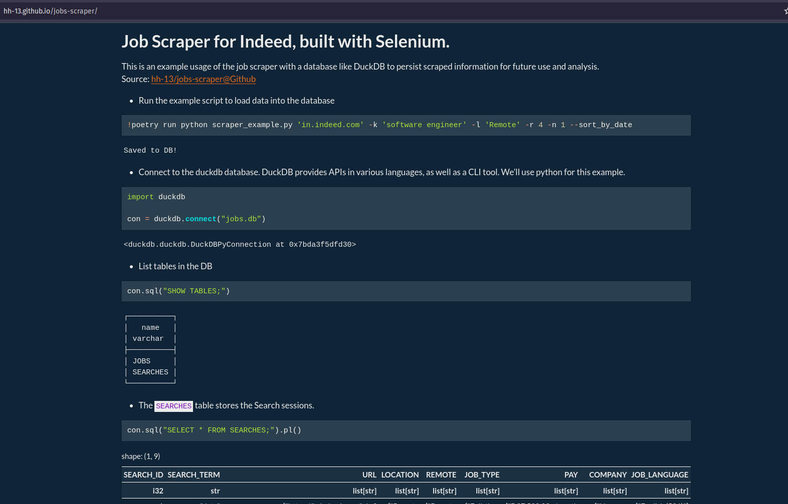

# jobs-scraper

A selenium-based job scraper in Python. Automate your job search by retrieving job listings from popular job portals, and storing them in a database ([duckdb](https://duckdb.org/)) for easy management and analysis. 

Have a look at the Quarto-based demo at [hh-13.github.io/jobs-scraper](https://hh-13.github.io/jobs-scraper)!



<details>
<summary>Table of Contents</summary>

1. [About The Project](#about-the-project)
    - [The What and the Why](#the-what-and-the-why)
    - [Project Structure](#project-structure)
2. [Features](#features)
3. [Getting Started](#getting-started)
    - [Requirements](#requirements)
    - [Installation and Usage](#installation-and-usage)
    - [Examples](#examples)
4. [Usage](#usage)
    - [The video](#the-video)
    - [Snapshots](#snapshots)
5. [What's next](#whats-next)
6. [Keep Coding!](#keep-coding)

</details>

## About The Project

### The What and the Why

This project aims to quicken the process of finding relevant job listings from popular job portals by providing a simple interface to automate this task. With in-built functions for storing the scraped data into a database, it allows you to keep up with the market by analysing hundreds of listings on the go and monitoring the  pulse of the industry.

### Project Structure

```
src/
 -> indeed_scraper.py    - scraper object for Indeed
 -> utils.py             - generic classes for configuring portals and browsers
definitions.sql          - sample database definition for storing search results
poetry.lock              - lock file for poetry
pyproject.toml           - project configs
scraper_example.py       - example script for running the scraper, saving the data to the database and using it to view and analyse jobs

```


## Features

- Built on object-oriented principals to simplify adding more websites and job portals.
- Enables saving search results to a database.
- Easily break down and analyse the collected data using both SQL and Dataframe-based tools, thanks to duckdb.
- Automatically detect and handle 'Are you a Human?' pages (Upcoming!)

## Getting Started

### Requirements

- [Python 3](https://www.python.org/downloads/)
- [Selenium](https://pypi.org/project/selenium/)
- [DuckDB](https://pypi.org/project/duckdb/)
- [Pola-rs](https://pypi.org/project/polars/)
- [Markdownify](https://pypi.org/project/markdownify/)

### Installation and Usage
```console
# Clone this repo and cd into it
foo@bar:~$ git clone https://github.com/hH-13/jobs-scraper.git
foo@bar:~$ cd jobs-scraper

# Set up the virtual environment:
foo@bar:~$ poetry install

# Activate the virtual environment (alternatively, ensure any python-related command is preceded by poetry run):
foo@bar:~$ poetry shell

# Run the program
foo@bar:~$ poetry run python scraper_example.py  --help
usage: scraper_example.py [-h] -k KEYWORDS -l LOCATION [-r RADIUS] [--sort_by_date] [-n NUM_PAGES] [top_level_domain]

Scrape a job portal for job listings. Currently only supports Indeed.

positional arguments:
  top_level_domain      The regional indeed website to search, e.g. `www.indeed.com` for the USA or `in.indeed.com` for India

options:
  -h, --help            show this help message and exit
  -k KEYWORDS, --keywords KEYWORDS
                        Your search keywords, like "Software Engineer"
  -l LOCATION, --location LOCATION
                        Your search location, like "New York"
  -r RADIUS, --radius RADIUS
                        The search radius, in mi or km, depending on the location. Ignored if location is Remote.
  --sort_by_date        Sort the results by date. Default sorting method is by relevance
  -n NUM_PAGES, --num_pages NUM_PAGES
                        The number of pages of search results to return

```

### Examples

Have a look at this notebook [usage.qmd](usage.qmd) or the demo page at [hh-13.github.io/jobs-scraper](https://hh-13.github.io/jobs-scraper) for usage examples.


## What's next?

The possibilites are endless!

- Extract specific details from Job descriptions using Natural-language processing tools, or LLMs using Retrieval-augmented Generation techniques.
- Create an embeddings map of the descriptions to spot patterns.
- Stay on top of the latest trends in the job markets by monitoring the top keywords in a search session.

## Keep Coding!
